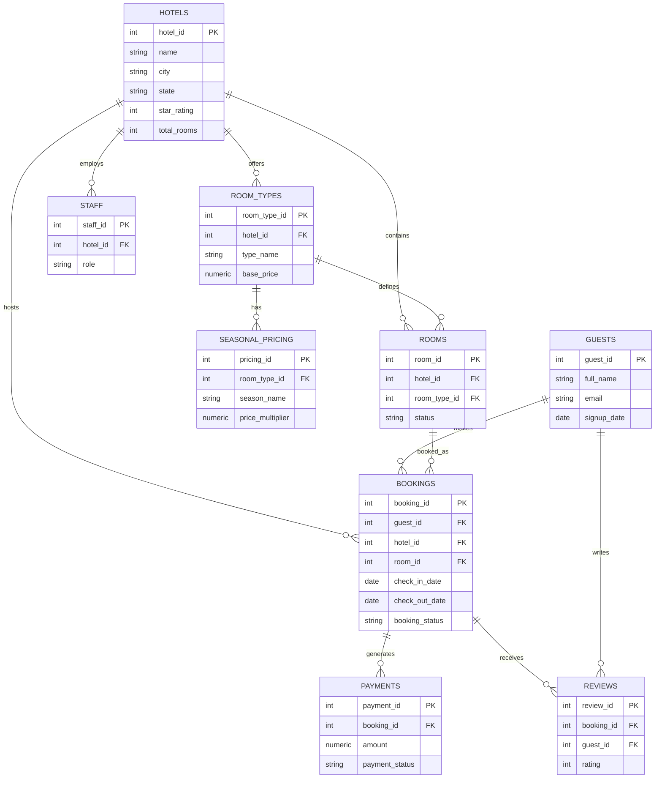

# Entity-Relationship Diagram — Hotel Booking System

This diagram renders automatically on GitHub (and most modern Markdown viewers) since it uses [Mermaid](https://mermaid.js.org/) syntax.

## How to read it

- `hotels` and `guests` are the two independent parent tables.
- `bookings` is the central hub — it references `guests`, `hotels`, and `rooms`, and is itself referenced by both `payments` and `reviews`.
- `room_types` bridges `hotels` to both `rooms` and `seasonal_pricing`.
